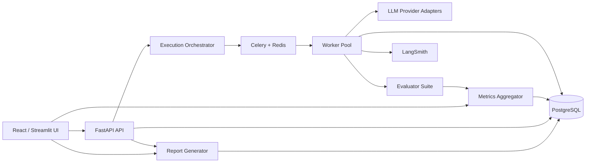
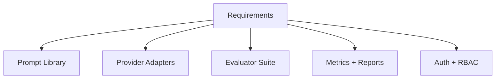
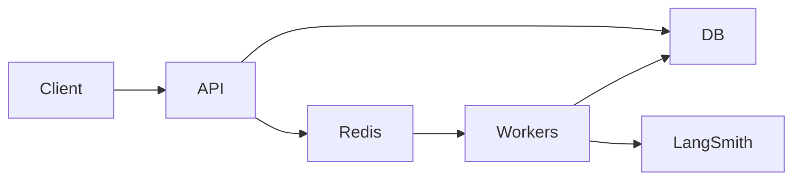
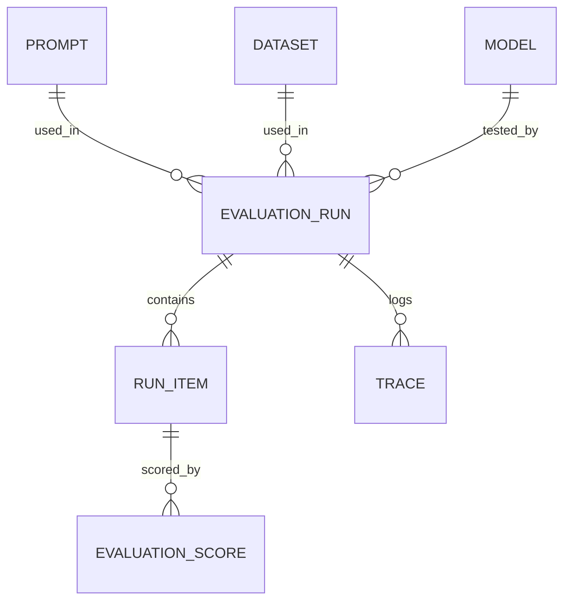
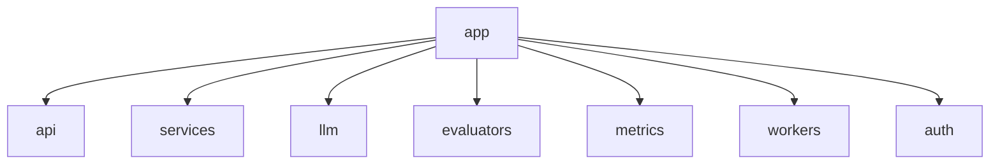
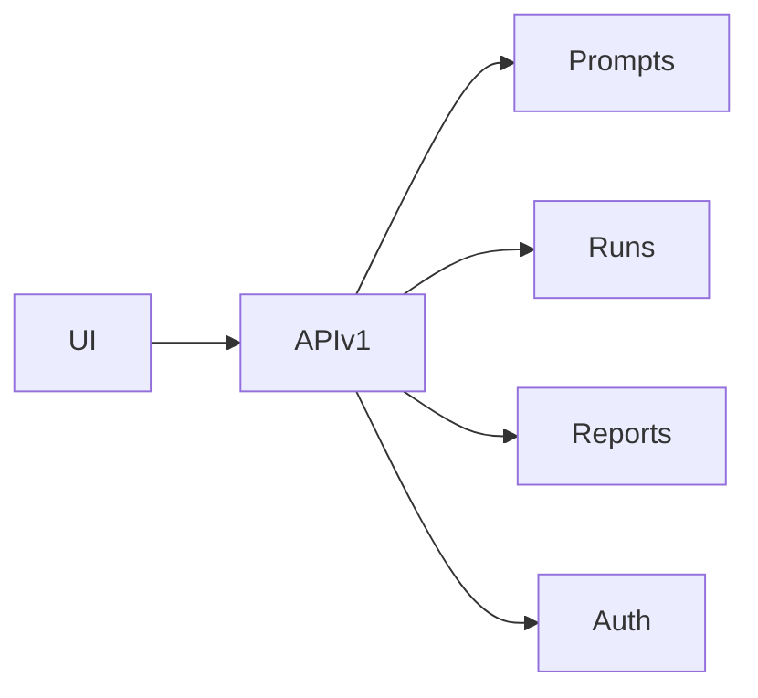
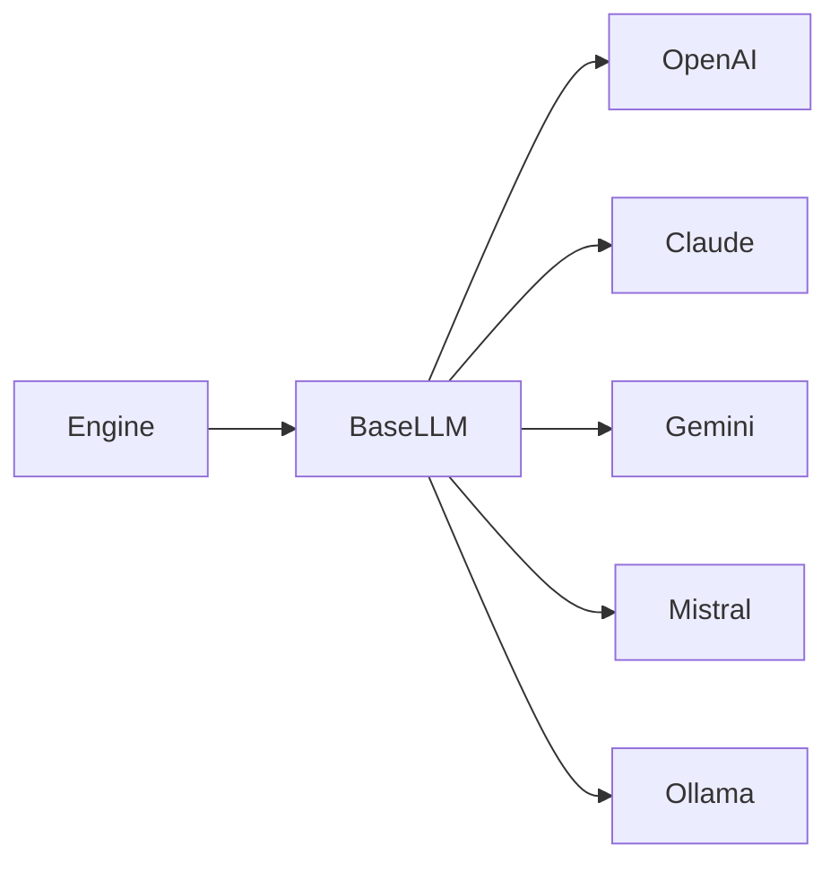
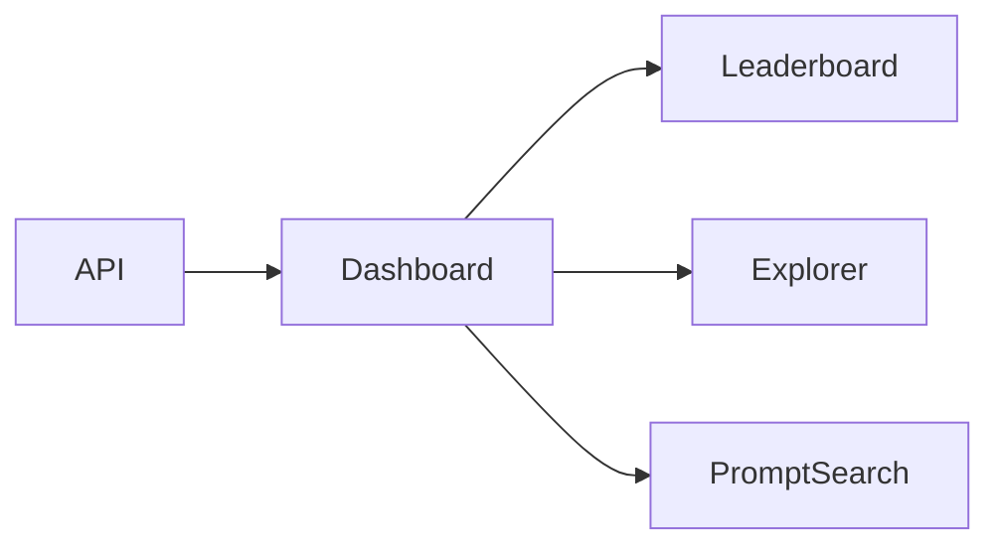
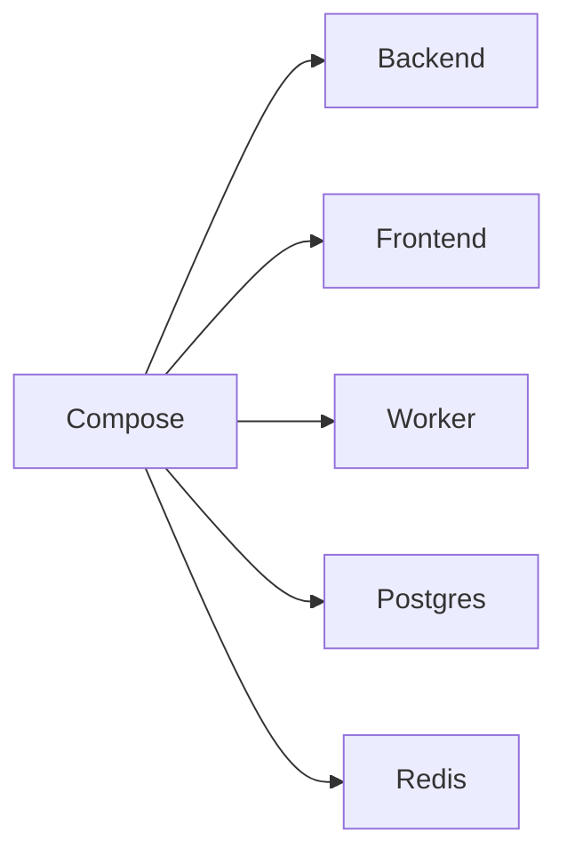
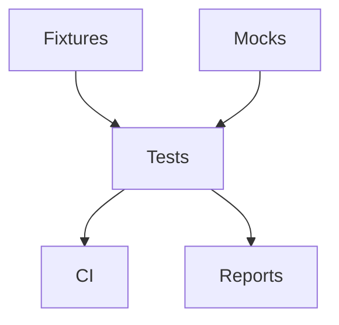

# Implementation Plan

## Executive Summary

This project is an internal-grade LLM evaluation and red-teaming system. The core design goal is not to provide a chatbot UI, but to build an evaluation platform that can ingest prompts, route them across providers, score outputs with independent evaluators, persist every experiment, and compare model versions over time.

The architecture is deliberately split into a control plane and a data plane:

- Control plane: prompt library, evaluation configuration, experiment orchestration, auth, API, reporting, and dashboard.
- Data plane: provider adapters, worker execution, evaluator execution, tracing, metrics aggregation, and persistence.

## High-Level Architecture

## Core Product Principles

- Every run must be reproducible.
- Every prompt, response, score, and trace must be persisted.
- Providers and evaluators must be pluggable behind stable interfaces.
- Evaluation should be parallelized, rate-limited, and resumable.
- Metrics must be queryable by model, prompt version, dataset version, and run timestamp.
- The system should support regression testing in CI as a first-class use case.

## Phase 1. Requirements Freeze

### Goal
Lock the product scope, non-functional requirements, and evaluation taxonomy before implementation.

### Design decisions
- Treat provider support, evaluator support, and reporting as separate subsystems.
- Use failure categories as a canonical output contract across evaluators.
- Prefer batch evaluation pipelines over synchronous request/response flows.
- Make observability and traceability mandatory from day one.

### Trade-offs
- More upfront design time, but fewer refactors later.
- Slightly slower initial delivery, but a much cleaner foundation for interview-grade architecture.

### Architecture diagrams

### Folder structure
- docs/
- backend/
- frontend/
- infra/
- tests/

### Files to implement
- README.md
- docs/IMPLEMENTATION_PLAN.md
- docs/requirements.md
- docs/failure-taxonomy.md

### Why this design scales
It establishes a single source of truth for scope and evaluator outputs, which prevents schema drift and keeps later phases composable.

### Interview talking points
- How you prevented product sprawl by freezing the evaluation contract early.
- Why canonical failure categories matter for regression analysis.
- Why observability is part of the product, not an afterthought.

## Phase 2. System Design

### Goal
Define the service boundaries, runtime topology, and request flow.

### Design decisions
- FastAPI remains the API and orchestration layer.
- Celery handles long-running jobs and parallel worker execution.
- PostgreSQL stores all durable data, including run metadata and prompt versions.
- Redis is used for queues, rate-limit coordination, and transient coordination.

### Trade-offs
- Celery adds operational complexity, but it is a proven fit for parallel evaluation workloads.
- A modular monolith is preferred initially over microservices to reduce operational overhead.

### Architecture diagrams

### Folder structure
- backend/app/core
- backend/app/api
- backend/app/services
- backend/app/workers
- backend/app/metrics

### Files to implement
- backend/app/main.py
- backend/app/core/config.py
- backend/app/core/logging.py
- backend/app/api/dependencies.py

### Why this design scales
A modular monolith keeps the first version fast to ship while preserving clear seams for later service extraction.

### Interview talking points
- Why a modular monolith beats premature microservices for this workload.
- How Redis and Celery separate orchestration from execution.
- How you would evolve the architecture for larger throughput.

## Phase 3. Database Schema

### Goal
Model prompts, datasets, runs, traces, metrics, evaluations, and reports in PostgreSQL.

### Design decisions
- Use versioned prompt and dataset records instead of in-place mutation.
- Store raw responses and derived metrics separately.
- Normalize model/provider metadata so comparisons remain stable over time.
- Use UUID primary keys and explicit foreign keys for auditability.

### Trade-offs
- More tables and versioning rules, but stronger reproducibility and lineage.
- Slightly more schema complexity, but much better regression analysis.

### Architecture diagrams

### Folder structure
- backend/app/db
- backend/app/models
- backend/app/schemas
- backend/app/repositories

### Files to implement
- backend/app/db/base.py
- backend/app/models/*.py
- backend/app/schemas/*.py
- backend/alembic.ini
- backend/alembic/versions/*

### Why this design scales
Versioned records make longitudinal comparisons and regression analysis reliable even as prompts and models evolve.

### Interview talking points
- Why immutable versions are better than overwriting prompt rows.
- How you would query regression deltas across model versions.
- Why separating raw outputs from derived metrics improves auditability.

## Phase 4. Folder Structure

### Goal
Create a clean codebase layout that matches runtime responsibilities.

### Design decisions
- Organize by domain capability, not by technical layer alone.
- Keep provider adapters, evaluators, and reporting modules isolated.
- Separate API contracts from service logic and persistence logic.

### Trade-offs
- More folders up front, but much lower cognitive overhead at scale.
- Slightly more navigation cost, but clearer ownership boundaries.

### Architecture diagrams

### Folder structure
- backend/app/api/routers
- backend/app/services
- backend/app/llm/providers
- backend/app/evaluators
- backend/app/metrics
- backend/app/auth
- backend/app/reports
- frontend/src/dashboard
- frontend/src/charts
- frontend/src/leaderboards
- frontend/src/prompt-library

### Files to implement
- backend/app/__init__.py
- backend/app/api/__init__.py
- backend/app/llm/__init__.py
- frontend/src/main.tsx
- frontend/src/App.tsx

### Why this design scales
The structure maps directly to product capabilities, which makes parallel development and later ownership changes easier.

### Interview talking points
- Why capability-oriented folders reduce accidental coupling.
- How the structure supports both backend and frontend scaling.

## Phase 5. API Design

### Goal
Define versioned REST endpoints for prompts, runs, evaluations, reports, auth, and exports.

### Design decisions
- Version the API from day one.
- Use resource-oriented endpoints.
- Make synchronous endpoints lightweight and push evaluation workloads into async jobs.
- Document everything through OpenAPI.

### Trade-offs
- More endpoint surface area, but a much cleaner contract for integrations.
- Async APIs require job status polling or event streaming, but they fit long-running evaluation workloads.

### Architecture diagrams

### Folder structure
- backend/app/api/routers
- backend/app/api/schemas
- backend/app/services

### Files to implement
- backend/app/api/routers/prompts.py
- backend/app/api/routers/runs.py
- backend/app/api/routers/reports.py
- backend/app/api/routers/auth.py
- backend/app/api/schemas/*.py

### Why this design scales
Stable, versioned endpoints allow UI, CI, and external tooling to integrate without breaking changes.

### Interview talking points
- Why the API should expose jobs instead of blocking on evaluation completion.
- How OpenAPI helps internal platform adoption.

## Phase 6. Provider Architecture

### Goal
Build a uniform abstraction for OpenAI, Claude, Gemini, Mistral, and Ollama.

### Design decisions
- Define a common BaseLLM interface with generate, count_tokens, calculate_cost, and provider_name.
- Encapsulate provider-specific auth, retry, streaming, and token accounting behind adapters.
- Normalize responses into a shared message schema.

### Trade-offs
- Adapter abstraction introduces some indirection, but it makes multi-provider benchmarking realistic.
- Token accounting may be approximate for some providers, but a uniform contract is more valuable than provider-specific leakage.

### Architecture diagrams

### Folder structure
- backend/app/llm/providers
- backend/app/llm/types.py
- backend/app/llm/factory.py

### Files to implement
- backend/app/llm/base.py
- backend/app/llm/providers/openai.py
- backend/app/llm/providers/anthropic.py
- backend/app/llm/providers/gemini.py
- backend/app/llm/providers/mistral.py
- backend/app/llm/providers/ollama.py

### Why this design scales
A strict interface allows new providers to be added without changing the evaluation engine or UI contracts.

### Interview talking points
- Why provider normalization is essential for fair benchmarking.
- How you would handle provider-specific features without contaminating the common interface.

## Phase 7. Evaluation Engine

### Goal
Implement the batch execution engine and evaluator pipeline.

### Design decisions
- Execute prompts in parallel with bounded concurrency.
- Run evaluators independently so each score can be audited.
- Persist raw output, evaluator output, and aggregate metrics separately.
- Support retries, timeouts, and rate limits at the orchestration layer.

### Trade-offs
- Parallelism improves throughput, but requires careful rate limiting and failure handling.
- Independent evaluators increase observability, but also increase processing cost.

### Architecture diagrams

### Folder structure
- backend/app/evaluators/hallucination
- backend/app/evaluators/bias
- backend/app/evaluators/toxicity
- backend/app/evaluators/reasoning
- backend/app/evaluators/formatting
- backend/app/workers
- backend/app/metrics

### Files to implement
- backend/app/evaluators/base.py
- backend/app/evaluators/*/evaluator.py
- backend/app/workers/tasks.py
- backend/app/metrics/aggregator.py

### Why this design scales
A decoupled pipeline supports thousands of prompts, independent scoring, and later addition of new evaluators without reworking execution.

### Interview talking points
- How parallel execution and bounded concurrency coexist.
- Why evaluator independence improves diagnosis.

## Phase 8. Dashboard

### Goal
Provide a product-grade UI for leaderboard analysis, failure exploration, and prompt search.

### Design decisions
- Keep the dashboard read-optimized and analytics-heavy.
- Prioritize comparison views, failure distribution charts, and prompt-level drill-downs.
- Design for side-by-side model analysis as a first-class interaction.

### Trade-offs
- A richer dashboard takes longer than a basic list view, but it is far more valuable in interviews and in practice.
- React is more work than Streamlit, but it gives better control over UX and scale.

### Architecture diagrams

### Folder structure
- frontend/src/dashboard
- frontend/src/charts
- frontend/src/leaderboards
- frontend/src/filters
- frontend/src/evaluation-runs
- frontend/src/prompt-library
- frontend/src/reports

### Files to implement
- frontend/src/pages/DashboardPage.tsx
- frontend/src/components/LeaderboardTable.tsx
- frontend/src/components/FailureExplorer.tsx
- frontend/src/components/PromptSearch.tsx

### Why this design scales
A componentized analytics UI allows the platform to grow from a single leaderboard into a richer internal evaluation console.

### Interview talking points
- Why failure exploration matters more than only showing aggregate scores.
- How the UI supports regression analysis.

## Phase 9. Docker

### Goal
Make the full stack reproducible with containers.

### Design decisions
- One container each for backend, frontend, worker, Redis, and PostgreSQL.
- Use Docker Compose for local orchestration.
- Keep environment parity between local development and deployment.

### Trade-offs
- Containers add build complexity, but they remove environment drift.
- Compose is sufficient for local and interview-ready demonstration, even before Kubernetes.

### Architecture diagrams

### Folder structure
- infra/docker
- infra/compose

### Files to implement
- docker-compose.yml
- backend/Dockerfile
- frontend/Dockerfile
- infra/docker/*.sh

### Why this design scales
Containerization makes it easier to run the same system locally, in CI, and in staging.

### Interview talking points
- Why Compose is the right first step before Kubernetes.
- How you would promote the same images to CI and production.

## Phase 10. Testing

### Goal
Validate providers, evaluators, orchestration, API contracts, and regression behavior.

### Design decisions
- Use pytest for backend unit and integration tests.
- Mock provider responses for deterministic evaluation tests.
- Add contract tests for schemas and report generation.
- Include regression fixtures for prompt suites and expected failure categories.

### Trade-offs
- Comprehensive tests take time to author, but they are essential for trust in an evaluation platform.
- Mocking providers reduces realism, but it makes CI deterministic and fast.

### Architecture diagrams

### Folder structure
- tests/unit
- tests/integration
- tests/fixtures
- backend/app/tests

### Files to implement
- tests/unit/test_providers.py
- tests/unit/test_evaluators.py
- tests/integration/test_runs.py
- tests/fixtures/*.json

### Why this design scales
A deterministic test suite is what makes an evaluation platform reliable enough to trust for regression gating.

### Interview talking points
- How you would structure test fixtures for model regressions.
- Why provider mocking is essential for CI stability.

## Recommended Build Order

1. Freeze requirements and failure taxonomy.
2. Design the schema and core interfaces.
3. Scaffold the backend and frontend structure.
4. Implement provider adapters and the run pipeline.
5. Add evaluators and metrics aggregation.
6. Build the dashboard and reports.
7. Containerize the stack.
8. Add regression and integration tests.

## Approval Gate

I have not generated implementation code yet. The next safe step is Phase 1 approval, after which I will create the concrete project scaffold and begin implementation in the agreed order.